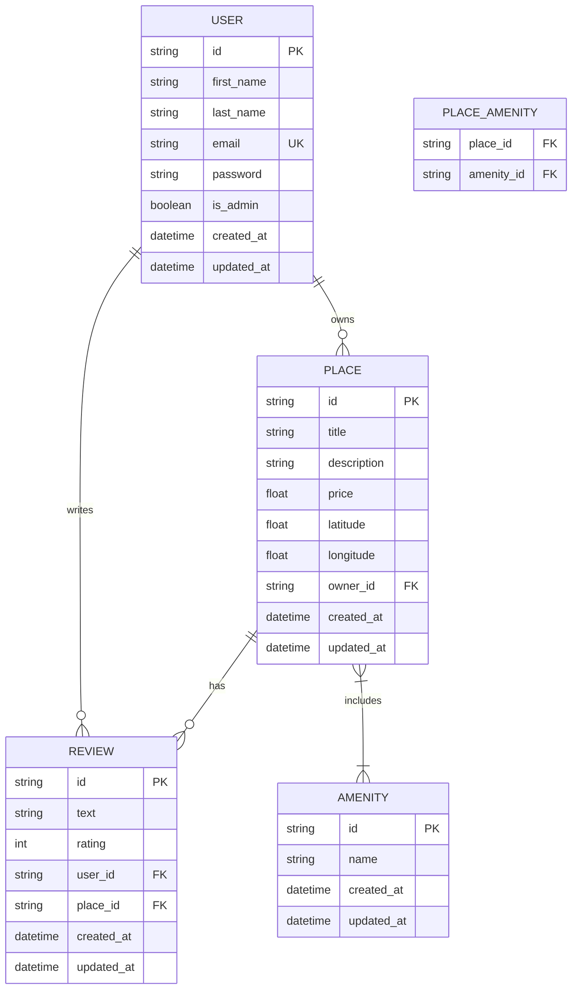

# HBnB – Part 3: Enhanced Backend with Authentication and Database Integration

## 📌 Project Overview
Part 3 of the **HBnB project** enhances the backend by introducing **authentication, authorization, and persistent database storage**.

In earlier parts, the application relied on **in-memory storage**, which is suitable for prototyping but not for real-world systems. In this phase, the project transitions to a **relational database using SQLAlchemy with SQLite for development**, while preparing the system for **MySQL in production environments**.

Additionally, the API is secured using **JWT-based authentication**, ensuring that only authenticated users can access protected endpoints and resources.

---

## 🎯 Project Objectives

### Authentication and Authorization
- Implement **JWT authentication** using `Flask-JWT-Extended`.
- Secure API endpoints so that only authenticated users can access them.
- Implement **role-based access control** using the `is_admin` attribute.

### Database Integration
- Replace **in-memory storage** with **SQLite** for development.
- Use **SQLAlchemy ORM** for database operations.
- Prepare the system for **MySQL** in production.

### CRUD Operations with Persistence
- Refactor all CRUD operations to interact with the database.
- Ensure all entities are stored persistently.

### Database Design and Visualization
- Design the database schema using **Mermaid.js ER diagrams**.
- Define relationships between:
  - Users
  - Places
  - Reviews
  - Amenities

### Data Validation
- Enforce constraints in SQLAlchemy models.
- Validate input data before storing it in the database.

---

## 📚 Learning Objectives
By the end of this part of the project, you will be able to:

- Implement **JWT authentication** in a Flask API.
- Apply **role-based authorization**.
- Use **SQLAlchemy ORM** for relational database management.
- Design **entity relationships** in a database.
- Build a **secure and scalable backend**.
- Prepare an application for **production deployment**.

---

## 🏗 Project Structure
```
part3/  
├── app/  
│ ├── **init**.py  
│ │  
│ ├── api/  
│ │ ├── **init**.py  
│ │ └── v1/  
│ │ ├── **init**.py  
│ │ ├── auth.py  
│ │ ├── users.py  
│ │ ├── places.py  
│ │ ├── reviews.py  
│ │ └── amenities.py  
│ │  
│ ├── models/  
│ │ ├── **init**.py  
│ │ ├── base_model.py  
│ │ ├── user.py  
│ │ ├── place.py  
│ │ ├── review.py  
│ │ └── amenity.py  
│ │  
│ ├── services/  
│ │ ├── **init**.py  
│ │ ├── facade.py  
│ │ └── database/  
│ │ └── database.py  
│ │  
│ └── persistence/  
│ ├── **init**.py  
│ ├── repository.py  
│ └── sql/  
│ ├── schema.sql  
│ └── data.sql  
│  
├── tests/  
│ ├── **init**.py  
│ ├── test_models.py  
│ ├── test_facade.py  
│ ├── test_api_users.py  
│ ├── test_auth_admin.py  
│ ├── test_place_rel.py  
│ ├── test_relationships.py  
│ └── final_check_task8.py  
│  
├── run.py  
├── config.py  
├── requirements.txt  
├── er_diagram.mmd  
└── README.md
```

---

## 🗄 Database Design (ER Diagram)



## 🔐 Authentication

Authentication is implemented using **JWT tokens**.

### Login Flow

1. A user registers an account.
    
2. The user logs in using email and password.
    
3. The server returns a **JWT token**.
    
4. The token must be included in protected requests.
    

Example header:
```
Authorization: Bearer <JWT_TOKEN>
```
## ⚙️ Technologies Used

- Python 3
    
- Flask
    
- Flask-JWT-Extended
    
- SQLAlchemy
    
- SQLite (development)
    
- MySQL (production)
    
- Mermaid.js (ER diagrams)
    
- bcrypt (password hashing)
    

---

## 📦 Installation

Clone the repository:
```bash 
git clone https://github.com/badriahalmalki/holbertonschool-hbnb.git
cd holbertonschool-hbnb/part3
```

Create a virtual environment:
```bash
python3 -m venv venv
source venv/bin/activate
```

Install dependencies:
```bash
pip install -r requirements.txt
```
## ▶️ Running the Application

Start the server:

```bash
python3 run.py
```

The API will run on:

```bash
http://localhost:5000
```

## 🧪 Example API Endpoints

### Register User

POST /api/v1/users

### Login
```bash
POST /api/v1/auth/login
```


### Get Places

```bash
GET /api/v1/places 
```

### Create Review (Authenticated)

```bash
POST /api/v1/reviews 
```

---

## 🔒 Role-Based Access Control

Some endpoints are restricted to **administrators only**.

Examples include:

- Creating amenities
    
- Managing users
    

Admin privileges are controlled via:

```bash
is_admin = True
```

---

## 🚀 Future Improvements

- Add **MySQL configuration for production**
    
- Implement **pagination and filtering**
    
- Expand **unit and integration tests**
    
- Improve **API documentation**
    

---

## 👩‍💻 Authors

- Reem Abdulhadi Alshehri
    
- Badriah Barakat Almalki
    
- Ebtihal Alomari
